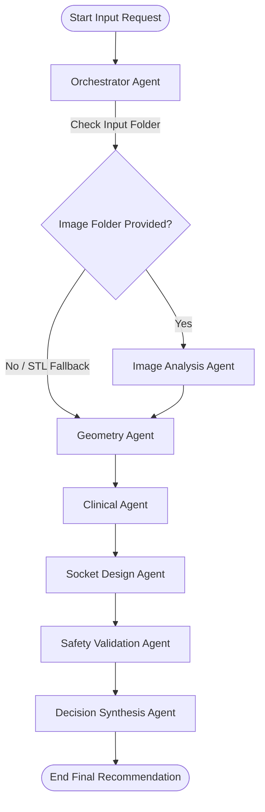

# Prosthetic Socket Recommendation System - Developer & AI Handover Guide

This document provides a comprehensive overview of the Prosthetic Socket Recommendation AI Agent system. It is designed to help any incoming AI agent or developer immediately understand the project goals, architecture, data schemas, active agents, and codebase structure.

---

## 🚀 System Overview

The **Prosthetic Socket Recommendation System** is a standalone, agentic AI platform built using **Python 3.11** and **LangGraph** (orchestrated as a `StateGraph`). 

Its primary purpose is to ingest patient clinical profiles, activity levels, and residual limb dimensions (parsed either via **2D clinical photography** or **3D STL mesh scans**) to synthesize optimal socket fabrication recommendations:
*   **Socket Design Type**: e.g., Total Surface Bearing (TSB), Patellar Tendon Bearing (PTB), or hybrid configurations.
*   **Suspension & Liner systems**: e.g., Suction, Pin Lock, elevated vacuum paired with Silicone/Polyurethane gel liners.
*   **Fabrication Parameters**: Structural wall thickness (mm), offset values (radial expansion, distal clearance, ply-fit compensation), trimline heights (cm), and recommended materials (e.g. Carbon Fiber).
*   **Safety Verification**: Automated enforcement of medical safety guidelines (e.g., ensuring neuropathic or diabetic patients receive soft gel liners to prevent skin breakdown, validating wall thicknesses against mechanical limits).

---

## 🛠️ Technology Stack & Key Dependencies

*   **Orchestration**: `LangGraph` for state management and agent execution loops.
*   **AI/LLM Models**: Google Gemini (via `langchain-google-genai` and ChatGoogleGenerativeAI) with structured outputs mapping directly to Pydantic schemas.
*   **3D Geometry Engine**: `Open3D` (optional) with pure `NumPy` fallbacks for parsing STL binary/ASCII files.
*   **Image Processing Engine**: `rembg` (background removal) and `OpenCV` (`cv2`) for contour detection and shape ratio profiling.
*   **Data Validation**: `Pydantic` (v2) for strictly enforced typing and nested request/response schemas.

---

## 🤖 Agent Architecture

The system utilizes an agentic workflow composed of **7 active agents** interacting through a shared graph state. An additional agent is present as a legacy file.

### Active Agents

| Agent Name | Class / File | Role & Primary Function | Input Dependencies | Outputs generated |
| :--- | :--- | :--- | :--- | :--- |
| **Orchestrator** | `OrchestratorAgent`<br>[orchestrator.py](file:///d:/Athidh/ai_agent/ai_agent/agents/orchestrator.py) | Manages graph state. Dynamically routes execution sequence based on whether patient images or an STL file was provided. | Initial Request | `routing_loop_count`, `next_step` |
| **Image Analysis** | `ImageAnalysisAgent`<br>[image_analysis_agent.py](file:///d:/Athidh/ai_agent/ai_agent/agents/image_analysis_agent.py) | Executes background removal and contour profiling on 2D patient limb photos to estimate shape, width ratio, and views. | `image_folder_path` | `image_analysis_results` |
| **Geometry** | `GeometryAgent`<br>[geometry_agent.py](file:///d:/Athidh/ai_agent/ai_agent/agents/geometry_agent.py) | **Mode 1**: Maps image analysis results into standardized metrics.<br>**Mode 2**: Ingests STL files, performs manifold repairs, computes precise length, volume, surface area, circumferences (at 20%, 50%, 80% heights) and classifies limb shape. | `image_analysis_results` OR `stl_file_path` | `geometry_analysis_results` |
| **Clinical** | `ClinicalAgent`<br>[clinical_agent.py](file:///d:/Athidh/ai_agent/ai_agent/agents/clinical_agent.py) | Analyzes pathologies, comorbidities (e.g. diabetes, neuropathy), skin condition, tissue mobility, and bony prominences. Proposes pressure-sensitive regions and socket design type from a medical standpoint. | Request Profile + Geometry Metrics | `clinical_analysis` |
| **Socket Design** | `SocketAgent`<br>[socket_agent.py](file:///d:/Athidh/ai_agent/ai_agent/agents/socket_agent.py) | Synthesizes physical geometry data and clinical reasoning to select exact fabrication dimensions, relief/pressure regions, liner types, and offsets. | Geometry Metrics + Clinical Findings | `socket_recommendation` |
| **Safety Validation** | `SafetyAgent`<br>[safety_agent.py](file:///d:/Athidh/ai_agent/ai_agent/agents/safety_agent.py) | Validates proposed designs against clinical rules: flags risk of ulceration (neuropathy + lack of liner), structural vulnerabilities (thickness < 3.0mm), and bony head reliefs. Sets `is_safe_to_fabricate`. | All Upstream Agent Data | `safety_analysis` |
| **Decision Synthesis** | `DecisionAgent`<br>[decision_agent.py](file:///d:/Athidh/ai_agent/ai_agent/agents/decision_agent.py) | Acts as final consensus arbiter. Resolves conflicts between clinical inputs and socket parameters, enforces safety overrides, and formats output. | All Upstream Agent Data | `final_response` |

> [!NOTE]
> **Legacy / Unused Agents**:
> *   `FeatureAgent` ([feature_agent.py](file:///d:/Athidh/ai_agent/ai_agent/agents/feature_agent.py)): Exists in the directory but is not imported or used in the active LangGraph workflow. It was superseded by `SocketAgent`.

---

## 📈 Execution Workflow

The diagram below represents the compiled `StateGraph` logic defined in [workflow.py](file:///d:/Athidh/ai_agent/ai_agent/workflow.py):



---

## 🗂️ Project Directory Layout

```text
ai_agent/
│── agents/                         # specialized AI and rule agents
│   ├── orchestrator.py             # manages state/routing
│   ├── image_analysis_agent.py     # handles 2D image analysis pipelines
│   ├── geometry_agent.py           # extracts physical dimensions (images/STL)
│   ├── clinical_agent.py           # clinical history and tissue analysis (Gemini)
│   ├── socket_agent.py             # details fabrication recommendations (Gemini)
│   ├── safety_agent.py             # validates safety rules (Gemini)
│   ├── decision_agent.py           # final consensus arbiter (Gemini)
│   └── feature_agent.py            # [LEGACY] unused skeleton template
│
├── prompts/                         # system instructions and clinical prompting
│   ├── clinical_prompt.py          # medical rules for ClinicalAgent
│   └── system_prompt.py            # general fallback instructions
│
├── models/                          # Pydantic schemas (V2)
│   ├── request.py                  # SocketRecommendationRequest structures
│   ├── response.py                 # SocketRecommendationResponse structures
│   ├── clinical.py                 # ClinicalAnalysis schemas
│   ├── geometry.py                 # GeometryAnalysis metrics schemas
│   ├── safety.py                   # SafetyAnalysis output schemas
│   └── socket_recommendation.py    # SocketRecommendation configuration schemas
│
├── tools/                           # helper processing pipelines
│   ├── gemini_client.py            # Google Gemini client wrapper
│   ├── validators.py               # static sanity checks
│   ├── mesh_loader.py              # STL mesh parsing, watertight validations & cleaning
│   ├── measurements.py             # geometry calculations (volume, circumferences, shape classification)
│   └── image_pipeline/             # sub-pipeline for 2D image processing
│       ├── remove_background.py    # background extraction using rembg
│       ├── image_feature_extractor.py # contour analysis & profile width calculation
│       ├── multi_image_analyzer.py # consensus view voting and confidence computation
│       └── image_analysis_loader.py # entry handler for image folders
│
├── tests/                           # verification test files
│   ├── test_image_pipeline.py      # E2E integration test with image inputs
│   └── test_image_recommendation_output.py # output payload formatter tests
│
├── scratch/                         # temporary validation and runner utilities
│   ├── run_recommendation_pipeline.py # executes pipeline using local mesh stubs
│   ├── run_image_recommendation.py # executes pipeline using a directory of images
│   ├── test_clinical_agent.py      # clinical agent unit tests
│   ├── test_decision_agent.py      # decision agent unit tests
│   ├── test_geometry_agent.py      # geometry agent unit tests
│   ├── test_image_analysis_agent.py # image analysis agent unit tests
│   ├── test_safety_agent.py        # safety agent unit tests
│   ├── test_socket_agent.py        # socket agent unit tests
│   └── verify_env_init.py          # validates Gemini API access
│
├── .env                             # api credentials & model configurations
├── requirements.txt                 # project library requirements
├── workflow.py                      # compiled LangGraph workflow graph definition
└── README.md                        # installation & overview instructions
```

---

## 📦 Core Data Models (Pydantic schemas)

The system relies on strict typing at every boundary. Here are the core data models defined in `models/`:

### 1. `SocketRecommendationRequest` ([request.py](file:///d:/Athidh/ai_agent/ai_agent/models/request.py))
Sent by the client. Contains:
*   `patient_id`, `age`, `weight_kg`, `activity_level` (K1-K4), `amputation_level` (transtibial/transfemoral).
*   `limb_details`: nested object with shape, length, proximal/mid/distal circumferences, skin condition, and bony prominences boolean flag.
*   `clinical_history`: has_diabetes, has_neuropathy, volume_fluctuations.
*   `stl_file_path`: (optional) local path for 3D processing.
*   `image_folder_path`: (optional) local folder for 2D image processing.

### 2. `GeometryAnalysis` ([geometry.py](file:///d:/Athidh/ai_agent/ai_agent/models/geometry.py))
Generated by the GeometryAgent. Contains:
*   `limb_length_cm`, `surface_area_cm2`, `volume_cm3`.
*   `cross_sectional_circumferences`: dict of heights at `80%`, `50%`, and `20%`.
*   `shape_descriptor`: conical, cylindrical, bulbous, or unknown.
*   `is_watertight`, `num_vertices`, `num_triangles`, `mesh_status` (e.g. "Clean", "Repaired").

### 3. `ClinicalAnalysis` ([clinical.py](file:///d:/Athidh/ai_agent/ai_agent/models/clinical.py))
Generated by the ClinicalAgent. Contains:
*   `limb_analysis_summary`: text analysis.
*   `pressure_sensitive_regions`: list of anatomical areas needing relief (name, risk level, justification).
*   `recommended_socket_type` & `recommended_socket_type_reasoning`.

### 4. `SocketRecommendation` ([socket_recommendation.py](file:///d:/Athidh/ai_agent/ai_agent/models/socket_recommendation.py))
Generated by the SocketAgent. Contains:
*   `socket_design_type`, `suspension_system`, `liner_type` with justifications.
*   `socket_wall_thickness_mm`.
*   `relief_regions` (anatomical zones to trim out with `depth_mm`).
*   `pressure_regions` (anatomical loading zones with `depth_mm`).
*   `offset_values`: `radial_expansion_mm`, `distal_clearance_mm`, `ply_fit_compensation`.

### 5. `SafetyAnalysis` ([safety.py](file:///d:/Athidh/ai_agent/ai_agent/models/safety.py))
Generated by the SafetyAgent. Contains:
*   `risk_score` (Low, Medium, High) & `risk_explanation`.
*   `validated_constraints`: list of checks (Liner Check, Wall Thickness check) indicating passed/failed status.
*   `is_safe_to_fabricate`: critical boolean flag. If `False`, fabrication is blocked.

### 6. `SocketRecommendationResponse` ([response.py](file:///d:/Athidh/ai_agent/ai_agent/models/response.py))
The final synthesized output produced by the DecisionAgent. Consolidates:
*   `patient_summary`, `geometry_summary`, `clinical_findings`, `socket_design`, `suspension_system`, `liner_recommendation`.
*   `relief_areas` and `pressure_tolerant_areas` lists with depths and reasonings.
*   `fabrication_approval`: boolean flag tied directly to safety check success.
*   `final_confidence_score` & `ai_explanation` of consensus or overrides.
*   `fabrication_parameters`: dictionary containing offset_values, thickness_mm, and materials.

---

## 🏃 Execution & Testing

### Setting Up Environment Variables
Create a `.env` file in the root workspace:
```env
GOOGLE_API_KEY=your_gemini_api_key_here
DEFAULT_MODEL_NAME=gemini-2.5-flash
DEFAULT_TEMPERATURE=0.2
```

### Running the End-to-End Workflow with a 3D STL file
Execute the scratch pipeline runner to test the workflow with dummy 3D geometry stubs:
```powershell
python scratch/run_recommendation_pipeline.py
```

### Running the End-to-End Workflow with 2D Images
Execute the image-based pipeline runner:
```powershell
python scratch/run_image_recommendation.py
```
*(Enter the path to your image directory when prompted)*

### Running Integration & Unit Tests
To verify all agents, state changes, mock Gemini clients, and assertions:
```powershell
python -m pytest tests/test_image_recommendation_output.py
python tests/test_image_pipeline.py
```
