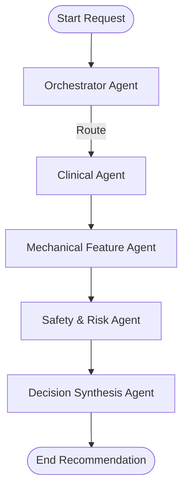

# AI Agent - Prosthetic Socket Recommendation System

A standalone Agentic AI system built using **Python 3.11** and **LangGraph** to recommend prosthetic socket designs based on patient clinical history, residual limb physical features, and lifestyle/activity levels.

## Overview

This repository provides the core AI logic, orchestration flow, and prompt definitions for recommending customized socket types, suspension systems, and fabrication materials. It is independent of backends, databases, frontend interfaces, or 3D socket generation software.

## Architecture

The workflow utilizes an agentic design where different specialized agents evaluate patient parameters and collaborate:



- **Orchestrator Agent**: Manages system state and coordinates overall execution flow.
- **Clinical Agent**: Analyzes pathologies, tissue tolerances, and diabetic/neuropathic history.
- **Mechanical Feature Agent**: Suggests suspension models, socket boundaries (TSB vs PTB), and materials.
- **Safety & Risk Agent**: Reviews proposed designs to prevent tissue breakdown or mechanical failure.
- **Decision Synthesis Agent**: Aggregates inputs, resolves conflicts, and outputs the final recommendation.

## Directory Structure

```text
ai_agent/
│── agents/
│   ├── orchestrator.py
│   ├── feature_agent.py
│   ├── clinical_agent.py
│   ├── safety_agent.py
│   └── decision_agent.py
│
├── prompts/
│   ├── clinical_prompt.py
│   └── system_prompt.py
│
├── tools/
│   ├── gemini_client.py
│   └── validators.py
│
├── models/
│   ├── request.py
│   └── response.py
│
├── workflow.py
├── config.py
├── requirements.txt
└── README.md
```

## Setup & Installation

1. **Prerequisites**: Python 3.11 installed.
2. **Install Dependencies**:
   ```bash
   pip install -r requirements.txt
   ```
3. **Configure Environment**:
   Create a `.env` file in the root directory:
   ```env
    GOOGLE_API_KEY=your_gemini_api_key_here
    DEFAULT_MODEL_NAME=gemini-2.5-flash
    DEFAULT_TEMPERATURE=0.2
   ```

## Development and TODOs

All files are structured as skeletons with explicit `TODO` markers. Implement the client logic in `tools/gemini_client.py` and refine prompt engineering in `prompts/` to start parsing dynamic LLM recommendations.

---

## Backend API Integration

The project has been refactored to support integration with a web API:
*   A new [backend/](file:///d:/Athidh/ai_agent/backend) folder contains the REST API server code.
*   The [backend/config.py](file:///d:/Athidh/ai_agent/backend/config.py) module manages database URIs, file upload folders (`./uploads`), and size/extension validation parameters.
*   The `ai_agent` module is packaged as an importable module. Importability can be verified using the root validation script:
    ```bash
    python test_import.py
    ```

